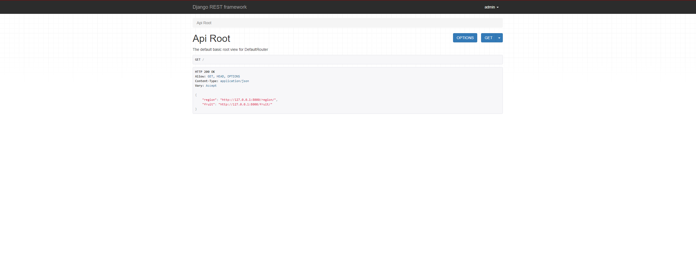
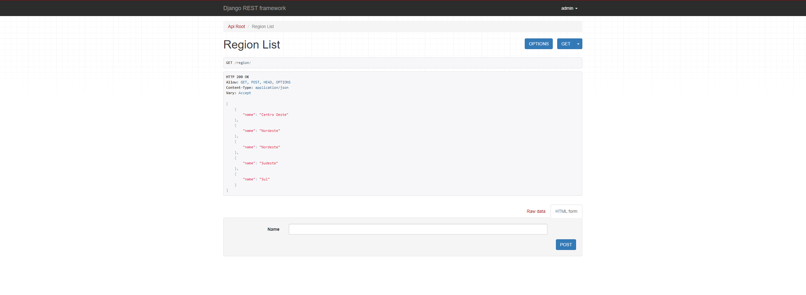
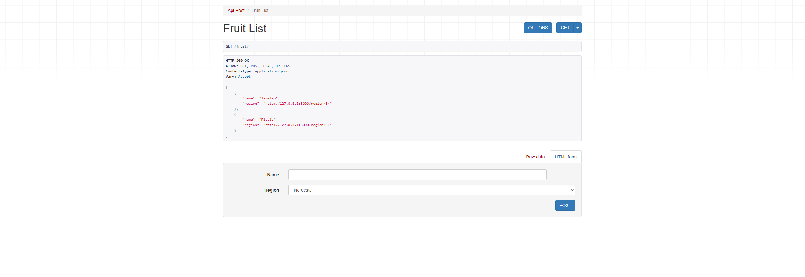

## Desafio Frexco


<h4 align="center">
  Repositório destinado a página criada para o desafio da Frexco.
</h4>

<div align="center">
    
    
    
    
    
</div>

## Tecnologias

No desenvolvimento do projeto, foi utilizado a linguagem [Python](https://www.python.org/) associada aos frameworks [Django](https://www.djangoproject.com/) e [Django Rest Framework](https://www.django-rest-framework.org/).

## Rodando a aplicação

- Para rodar o projeto, você precisa ter o [Python3](https://www.python.org/downloads/) instalado, de preferência com versões mais recentes.

**Clone o repositório e acesse a pasta clonada**

$ git clone https://github.com/enzoggqs/DESAFIO_FREXCO && cd desafio-kolabs

```
# Ative o ambiente virtual
$ cd vend && cd Scripts && ./activate

# Volte para a pasta raíz
$ cd .. && cd ..

# Acesse o projeto criado e rode o servidor
$ cd mysite & python manage.py runserver

```

A aplicação estará disponível para ser acessada em seu navegador em `http://localhost:8000` e estará pronta para interação com o usuário.

Made with 💜 by Enzo Gabriel [Check out my LinkedIn](https://www.linkedin.com/in/enzoggqs)